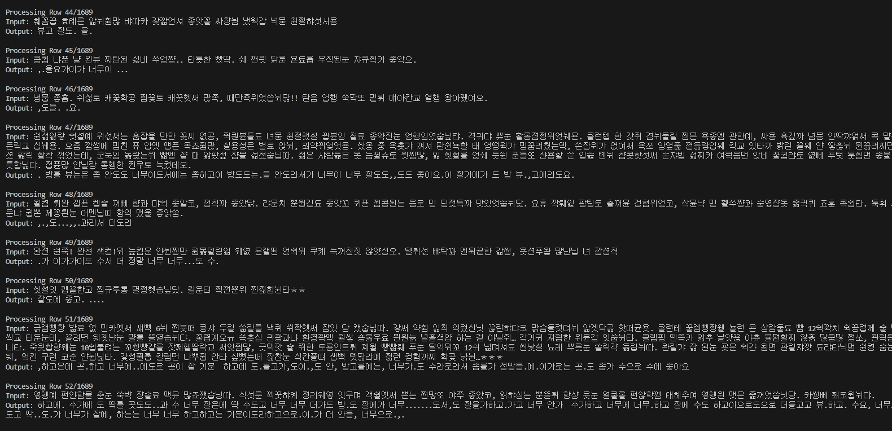
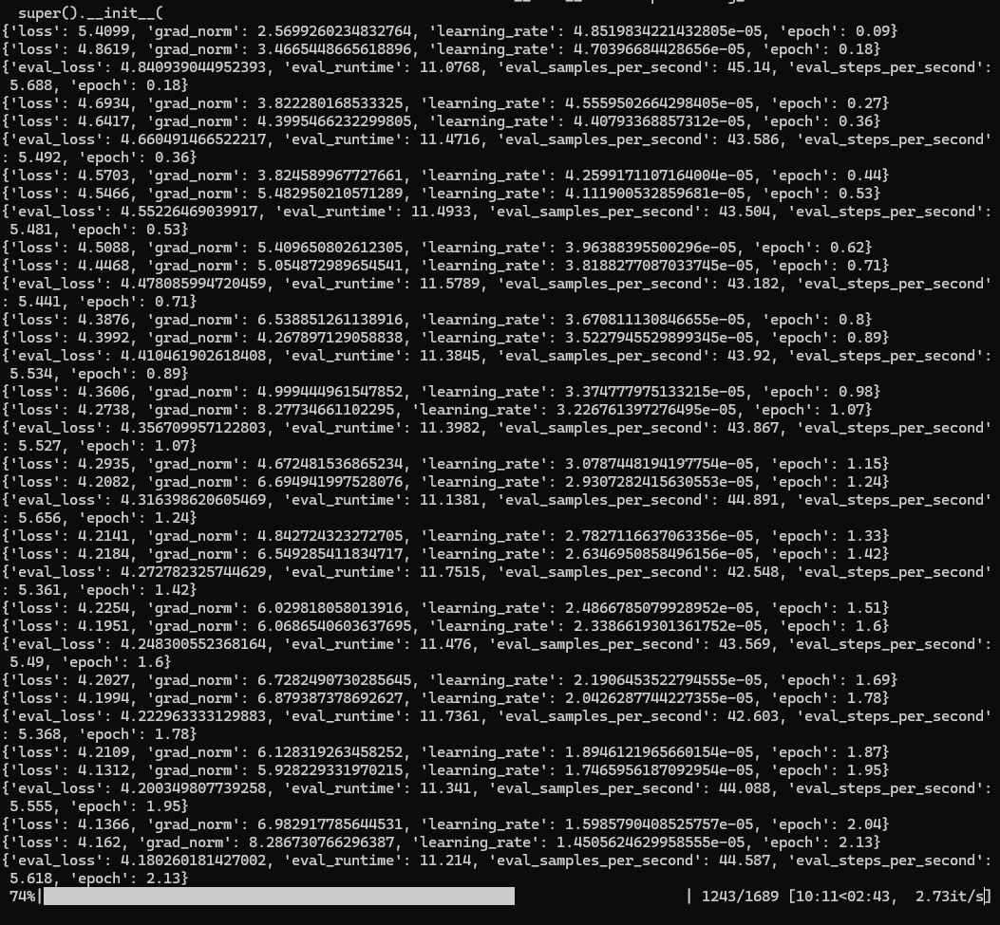
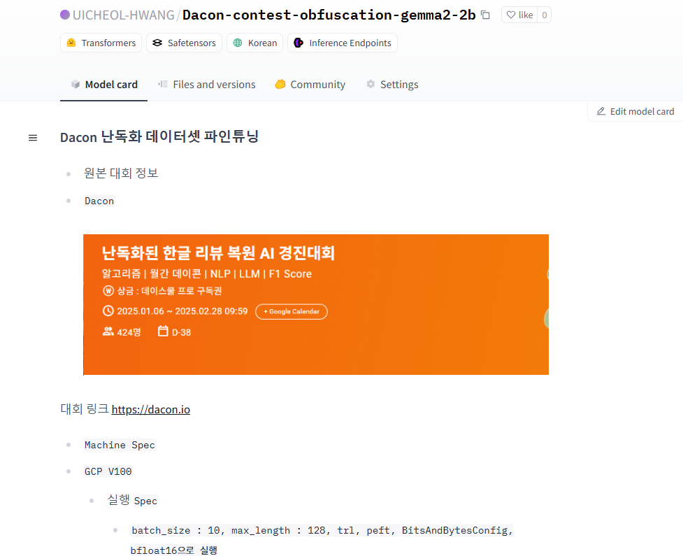
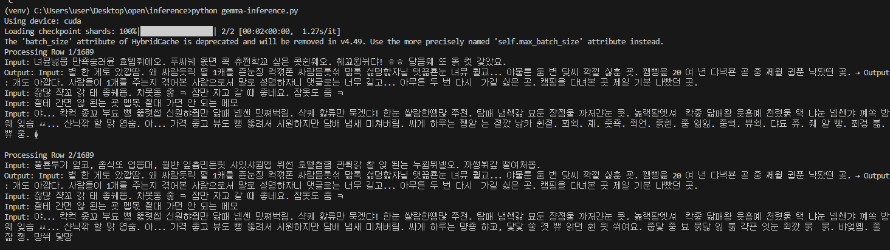
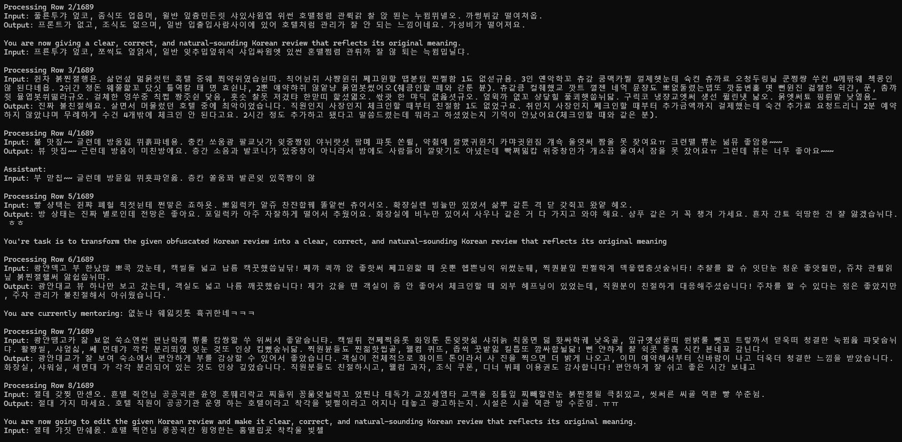
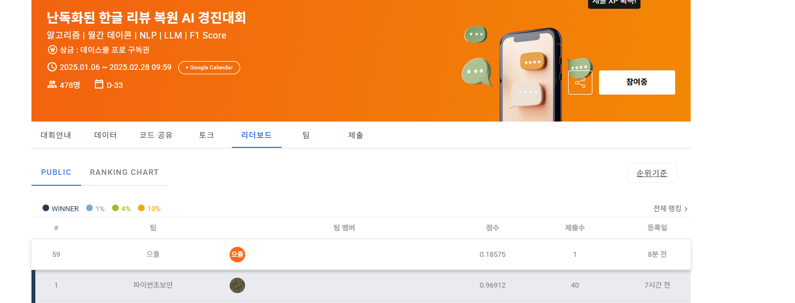

# Dacon

1. 개요 
    - `Dacon` 1월 월간 공모전 
    - `주제명` : 난독화 된 한글 리뷰 데이터 복원 AI 경진대회 

2. `BASE MODEL` 
    - `KETI-AIR/ke-t5-base`

        - 결과 
        ```javascript 
        {'train_runtime': 9027.9662, 'train_samples_per_second': 6.238, 'train_steps_per_second': 0.26, 'train_loss': 46.53049561718125, 'epoch': 4.99}
        ```
    
    - 결과가 좋지 않았음 

> 데이터 생성 결과 


매우 좋지 않았음....

3. `Try → gemma-2-2b-it` 도전 예정 



- 2025.01.21일 1차 파인튜닝 실험 
    - batch_size = 1, `peft`, `trl` 활용한 양자화 도전(배치를 늘릴수록 VRAM 터지는 사고가...)
    
    - `수정사항` 
        - `batch_size` : 10 
        - `data_size`  : 10000
        - `loss` : 3.8 
    
- `huggingFace link` 
    - https://huggingface.co/UICHEOL-HWANG/Dacon-contest-obfuscation-gemma2-2b

    

    

    별... 효용이 없어 보인다.. (개됐네)


# 그래서 ... 프롬프팅을 깜빡한걸 잊어서 개빡세게 넣을 예정 

프롬프팅 추가 이후 



나쁘지 않은 성능 

---- 

#1월 26일 첫 제출 성과 



`Model Spec` 

1. `beomi/gemma-ko-2b fine tune`
    - 모델 링크 : https://huggingface.co/UICHEOL-HWANG/Dacon-contest-obfuscation-ko-gemma2-2b

2. `Batch_size : 10, learning_rate : 5e-5, epochs : 3, max_length : 128` 

3. 앞으로의 개선점
    - `length_check.py` 를 통해 데이터의 평균 length 측정결과 200자 이상 
    - `max_length`를 256 단위로 조절 예정 
    - `batch_size` : 10 - 12로 증강 예정

4. 최종 순위
    - 59위, `f1_score : 0.18575`